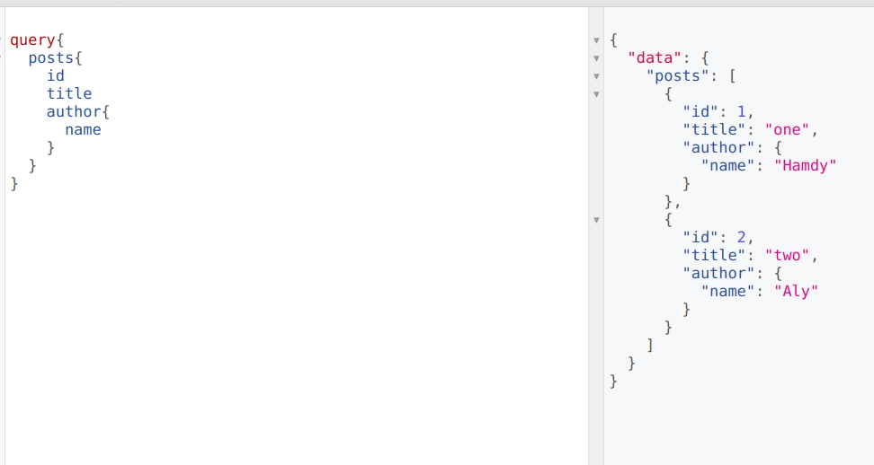
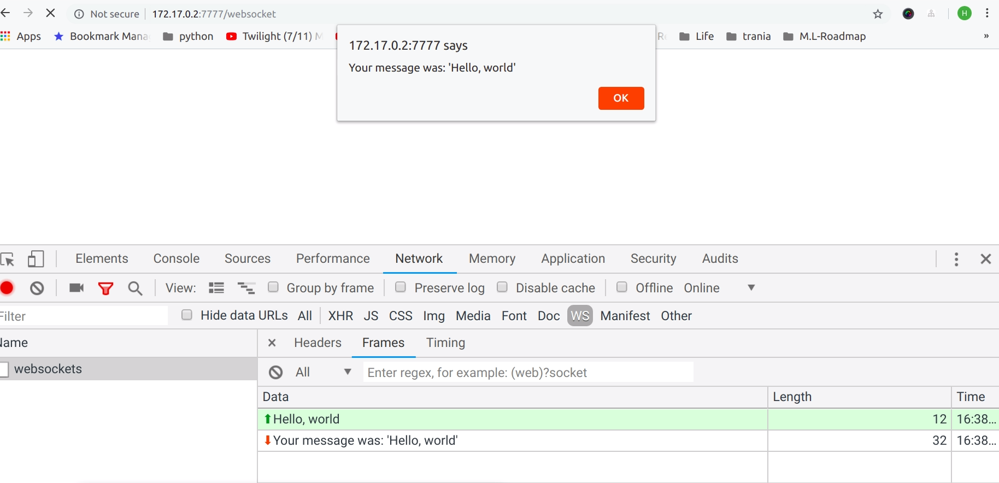
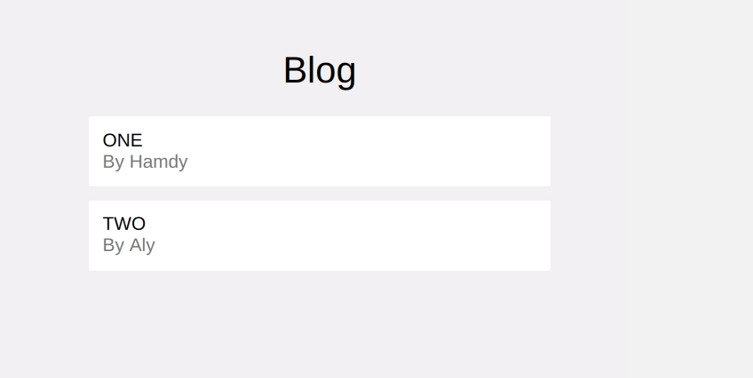

# Graphql server

## run

- use : `j.servers.graphq._server_test_start()`
- graphql server ports
    - `7777` Graphql normal queries & mutations
    - `7778` Graphql subscriptions (websockets)
  

### Test

#### GRAPHIQL

open browser on localhost:7777/graphiql

#### Websockets

A simple test to make sure that websocket port 7778 is open and working

open browser on `http://localhost:7777/websocket`, you should see

   

#### Vuejs Graphql integration

open browser on `http://localhost:7777/posts`, you should see

#### Vuejs Graphql subscriptions using websockets

open browser on `http://localhost:7777/counter`, you should see

